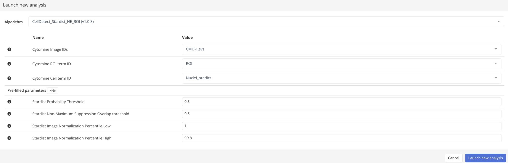
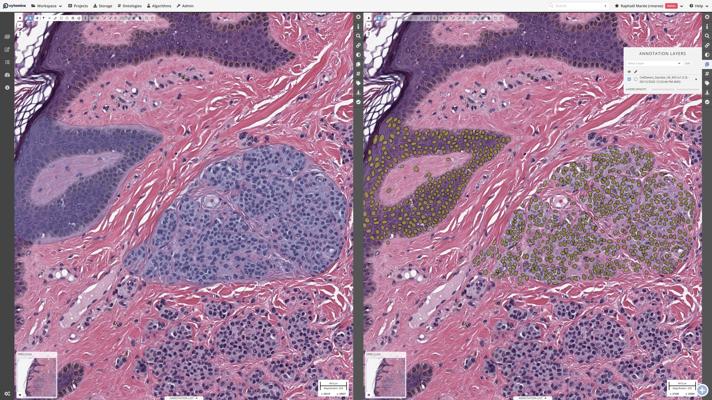
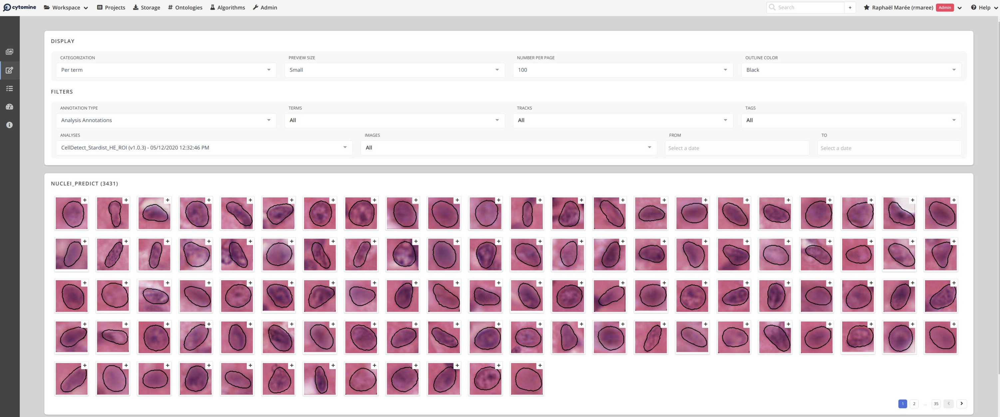

# S_CellDetect_Stardist_ROI
Cytomine (https://cytomine.org) app developed by ULiège Cytomine Research team (https://uliege.cytomine.org) for Cell/Nuclei detection in region of interests (ROIs), encapsulating Stardist Python code (https://github.com/mpicbg-csbd/stardist/) originally developed by Uwe Schmidt, Martin Weigert, Coleman Broaddus, and Gene Myers as published in Cell Detection with Star-convex Polygons. International Conference on Medical Image Computing and Computer-Assisted Intervention (MICCAI), Granada, Spain, September 2018.

This implementation follows Cytomine (=v3.0) external app conventions based on container technology. 
It applies a Stardist pre-trained model (versatile_HE) to Cytomine regions of interest within large whole-slide images. 

To launch such an analysis, a user first specify a Cytomine ROI annotation term identifier, a nuclei/cell term identifier, and a list of images where to apply the detector (see screenshot below). The app will then apply the algorithm to all Cytomine ROI annotations labeled by the user with this term, in the list of whole-slide images of the current project. Detected objects are labeled with the nuclei/cell term identifier.

While the original model provided by Schmidt et al. was trained with H&E images, it seems to produce decent results with other stainings and image types. Future work should compare how well it matches ground-truth on specific images (benchmarking) and investigate fine-tuned models with specific data to reach even better performance.

This version use tensorflow CPU version (See Dockerfile) to ensure compatibility with a larger number of computers. A GPU version should be possible by adapting the Dockerfile with tensorflow-gpu and/or nvidia-docker images.

Here is an example of StarDist detections in Cytomine web viewer of a whole-slide image:

